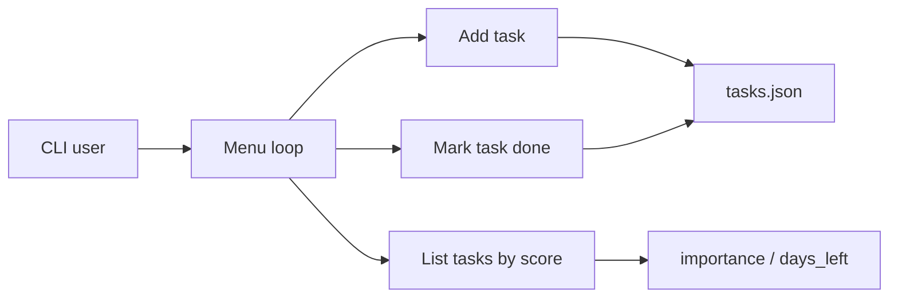

# Task_allocator

## Problem
This project solves a simple personal productivity problem: deciding which tasks to work on first when both deadline pressure and importance matter. It keeps a local to-do list and ranks tasks using an urgency score so high-impact work with short deadlines rises to the top.

## System Design

- Architecture:
  - the whole application lives in [`Task_allocator.py`](C:\Users\91965\cars24\github-readme-batch\Task_allocator\Task_allocator.py)
  - tasks are stored in a local JSON file
  - a command-line menu handles add, list, and complete flows
- Components:
  - persistence: `tasks.json`
  - logic: urgency scoring based on importance level and days remaining
  - interface: terminal-based text menu
- There is no LLM, DB server, API, retrieval layer, or agent system in this repo.

## Approach
- Why multi-agent?
  - Multi-agent is not used. A single local script is enough for this scheduling problem.
- Why RAG?
  - RAG is not relevant because the application performs local task ranking, not retrieval over external knowledge.
- What the code actually does:
  - collects task name, deadline, and importance
  - stores tasks in JSON
  - scores each task as `importance_factor / days_left`
  - sorts tasks by that score when listing them
  - marks a selected task as complete

## Tech Stack
- Python
- JSON file storage
- Standard library `datetime`

## Demo
- Run `Task_allocator.py`
- Add tasks with deadlines and importance levels
- List tasks to see the score-based prioritization
- Mark tasks as done from the command-line interface

## Results
- The repo is a small but complete local productivity tool.
- The practical benefit is faster prioritization:
  - no manual sorting
  - simple urgency scoring
  - persistent local task history between runs

## Learnings
- What worked:
  - the script is lightweight and easy to run without dependencies
  - combining importance and deadline into one score makes task ordering automatic
  - JSON persistence keeps the tool simple and understandable
- What did not:
  - completed-task selection can be inconsistent because `list_tasks()` shows a sorted view while `complete_task()` indexes into the unsorted stored list
  - there is no task editing, deletion, or input validation for malformed dates
  - the previous README had almost no documentation

## Supporting Docs
- [Architecture diagram](docs/architecture.png)
- [Evaluation logs and outputs](docs/evaluation.md)
- [Sample inputs and outputs](docs/sample_io.md)
- [Rich example assets](docs/examples/)
- [Representative outputs](docs/outputs/)
